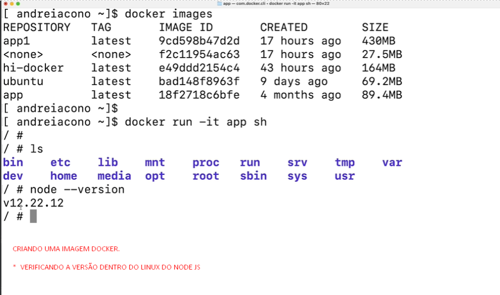
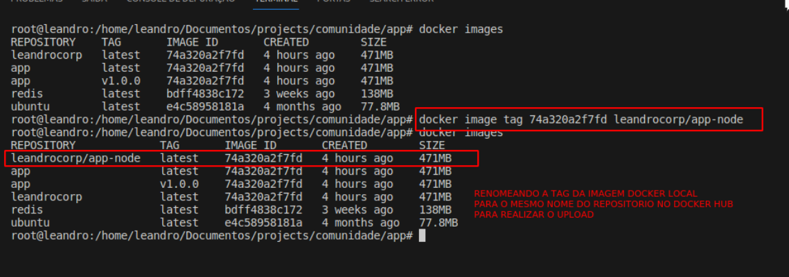
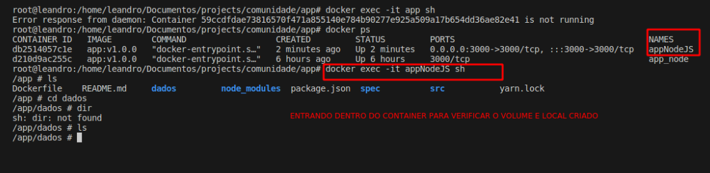

<!-- PROJECT LOGO -->
<br />
<div align="center">
  <a href="https://github.com/othneildrew/Best-README-Template">
    
  </a>

  <h3 align="center">Documentação do projeto e como usar o docker</h3>

</div>

<!-- ABOUT THE PROJECT -->
## About The Project

_Como instalar o docker no ubuntu [video](https://www.youtube.com/watch?v=5_EA3rBCXmU)_            
_Instalação do docker oficial no ubuntu: [Document](https://docs.docker.com/desktop/install/ubuntu/)_

### Estrutura inicial do projeto com docker

*  `Dockerfile`: Arquivo que contém as informações para a criação da
imagem do container.


* `docker build -t applicacao_node`: Gerando a imagem do projeto Docker.


* `docker run -t ubuntu`: Rodando uma imagem do ubuntu no modo interativo, para que não precisemos baixar de fato a imagem.


### Comando linux essenciais:

* Criando um novo usuario no linux
   ```sh
   useradd -m leandro
   ```
* Logando com um novo usuario:
   ```sh
    docker exec -it -u leandro id_container bash
    ```
* Listar grupos linux: 
   ```sh
   cat /etc/group
   ```
* Verificar a qual grupo um usuario pertence:
   ```sh
   groups leandro
   ```
* Tipos de permissões dentro do linux
   ```sh
    ls -l
   ```
   


* `docker images`: verificando as imagens que estão no docker.
* `docker ps`: verificando os containers que estão rodando.
* `docker run -it app sh`: executando o container no modo interativo.
* `node --version`: verificando a versão do node dentro da distro.



* ADD usado para adicionar arquivos do host para dentro do container.
  ```sh
    ADD
  ```


* COPY copiar o projeto para dentro da image alpine com node 18.
  ```sh
    COPY
  ```


* `apk add  --no-cache python3 g++ make .`: Rodando o python dentro da distro alpine


* `docker run -it app sh`: Rodando o container no modo interativo.
* `python --version`: Verificando a versão do python dentro da distro.


### Apagando e parando container dockers
* `docker rmi ID`: Removendo um container para apagar posteriomente a imagem docker.


* `docker run -dp 3000:3000 app`: Executando o projeto e mapeando a porta 3000 container para a porta 3000 do PC


* `docker build -t app:v1.0.0 .`: Inserindo uma tag na imagem do container.


* `docker image remove app:v1.0.0`: Removendo uma imagem docker


* `docker image tag app:v1.0.0`: Renomeando uma TAG dentro do docker.


* `docker image tag ID leandrocorp/app-node`: Realizando a nomeação do tag da imagem docker para o mesmo nome do repositório no docker hub



* `docker login`: Realizando o login no docker hub
* `docker push leandrocorp/app-node:v1.0.2`: Realizando o push da imagem para o docker hub


* `docker image save -o appv2.tar app:v2`: Salvando a imagem docker em um arquivo tar local.


* `docker image load -i appv2.tar`: Carregando a imagem docker a partir de um arquivo tar.


* `docker image rm app:latest`: Removendo uma imagem docker.


* `docker run -d app:v1.0.0`: Rodando o container no modo background


* `docker logs --help`: Verificando logs do seu container


* `docker run -d -p 80:3000 --name app app:v1.0.0`: redirecionando porta do container para a porta 80 do PC para que o container possa ser acessado pelo navegador.


* `docker stop app`: Parando de forma rapida um container 


* `docker rm -f objective_wing`: removendo de formar forçada um container


* `docker ps -a`: Listar todos os containers que estão rodando e parados


* `docker volume create app-node`: Criando um volume dentro de container


* `docker volume inspect app-dados`: Inspeccionando o volume criado


* `docker exec app_node ls`: Visualizando informações dentro do container sem precisamos entrar na distro


* `docker run -d -p 3000:3000 -name appNodeJS -v app-dados/app/dados app:v1.0.0`: Adicionando um container a um volume criado



* Ao apagamos o container e criamos outro container apontando para o mesmo diretório app/dados o arquivo docker.txt vai continuar existente pois ele é persistente e o container não, ideal para arquivos que seram idependentes do container.


# Docker compose

_Documentação docker compose [DOC](https://docs.docker.com/get-started/08_using_compose/)_            

* `docker compose version`: Verificando a versão do docker compose


* `docker compose version`: Versão docker compose


* Configuração inicial do docker compose


* Configurando os compose do docker para criação dos containers.


* Configuração dos containers no docker compose e suas respectivas portas, duvidas sobre como chegar a esta configuração estão na documentação: https://docs.docker.com/get-started/08_using_compose/ 


* `docker compose up -d`: Subindo aplicação com docker compose

* `docker compose down`: Parando aplicação com docker compose


* `docker compose ps`: Listando containers que estão rodando com docker compose
* `docker exec -it -u root <CONTAINER ID> sh`: Entrando no container com docker compose shell
* `ifconfig`: Verificar configurações de rede


### Tecnologias abrangidas no projeto

Segue abaixo as técnologias que foram abordadas no projeto, e que podem ser utilizadas para a criação do projeto:

* [![Docker][Docker.com]][Docker-url]
* [![GitHub][github.svg]][Github-url]
* [![Bootstrap][Bootstrap.com]][Bootstrap-url]
* [![Node][Node.com]][Node-url]
* [![Javascript][Javascript.com]][Javascript-url]


### Installation

_Below is an example of how you can instruct your audience on installing and setting up your app. This template doesn't rely on any external dependencies or services._

1. Get a free API Key at [https://example.com](https://example.com)
2. Clone the repo
   ```sh
   git clone https://github.com/your_username_/Project-Name.git
   ```
3. Install NPM packages
   ```sh
   npm install
   ```
4. Enter your API in `config.js`
   ```js
   const API_KEY = 'ENTER YOUR API';
   ```

<p align="right">(<a href="#readme-top">back to top</a>)</p>


##  O que foi abordado no projeto 

- [x] Criação de container
- [x] Gestão de containers
- [ ] Kubernet (faltando os os orquestradores de containers)
- [x] Gestão de volumes
- [ ] Multi-language Support
    - [ ] Chinese
    - [ ] Spanish


[Docker.com]: https://img.shields.io/badge/Docker-2496ED?style=for-the-badge&logo=docker&logoColor=white
[Docker-url]: https://www.docker.com

[Github.svg]: https://img.shields.io/badge/GitHub-100000?style=for-the-badge&logo=github&logoColor=white
[Github-url]: https://github.com/john-doe


[Bootstrap.com]: https://img.shields.io/badge/Bootstrap-563D7C?style=for-the-badge&logo=bootstrap&logoColor=white
[Bootstrap-url]: https://getbootstrap.com

[Node.com]: https://img.shields.io/badge/Node.js-43853D?style=for-the-badge&logo=node.js&logoColor=white
[Node-url]: https://nodejs.org/en/

[Javascript.com]: https://img.shields.io/badge/JavaScript-F7DF1E?style=for-the-badge&logo=javascript&logoColor=black
[Javascript-url]: https://www.javascript.com